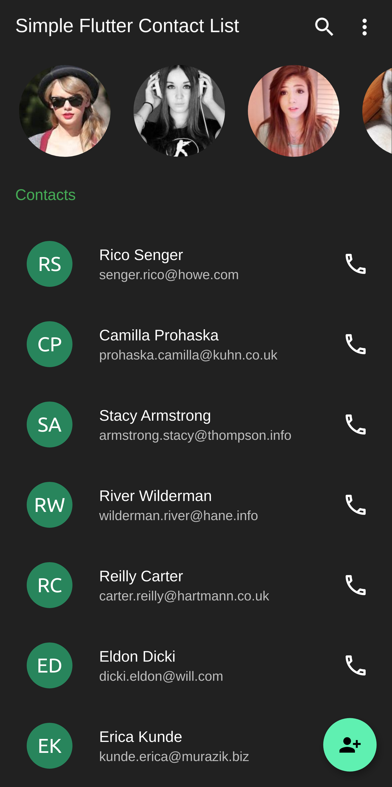
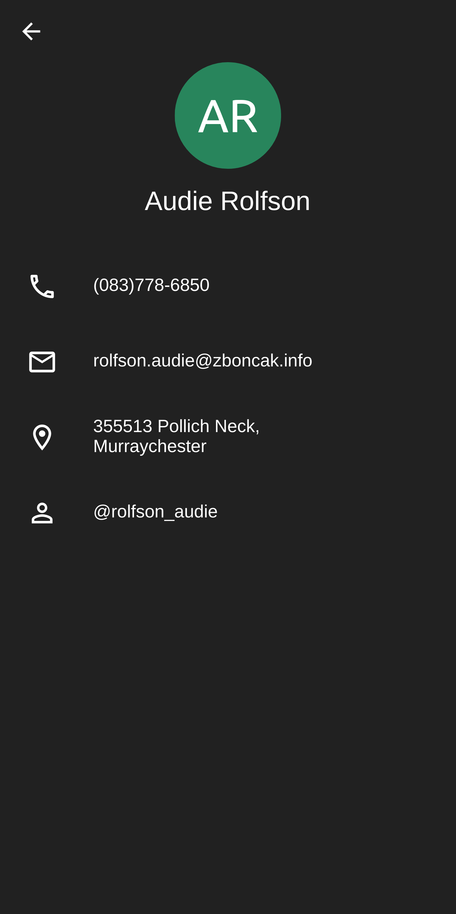

# Simple Flutter Contact List

Simple Flutter App to generate some fake data and display it as a contact list. Useful to understand some concepts that can be used in Flutter Apps like:

- generate fake test data
- implement simple navigation between screen
- horizontal and vertical scrollview

The final result is 

| Home | Details |
|  --- |  ---    |
|||

This app is built with [Flutter](https://flutter.dev/) 2.2, with Sound Null Safety, and works out of the box on:

:white_check_mark: Android 
:white_check_mark: iOS 
:white_check_mark: Web 

You can find the full article on: [Create a Simple Contact App with Faker & Flutter](https://blog.albertobonacina.com/create-a-simple-contact-app-with-faker-and-flutter)
### License

Distributed under the MIT License. See `LICENSE` for more information.
